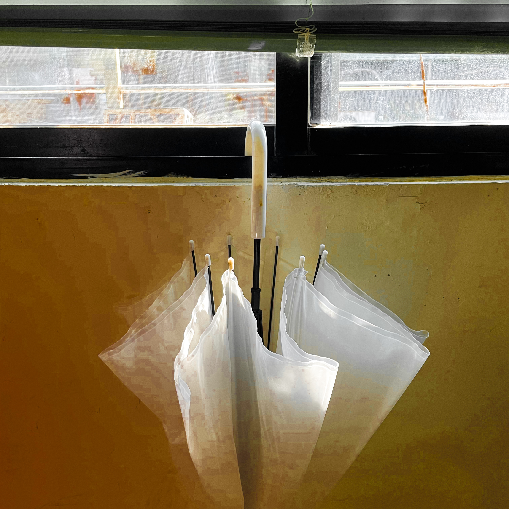
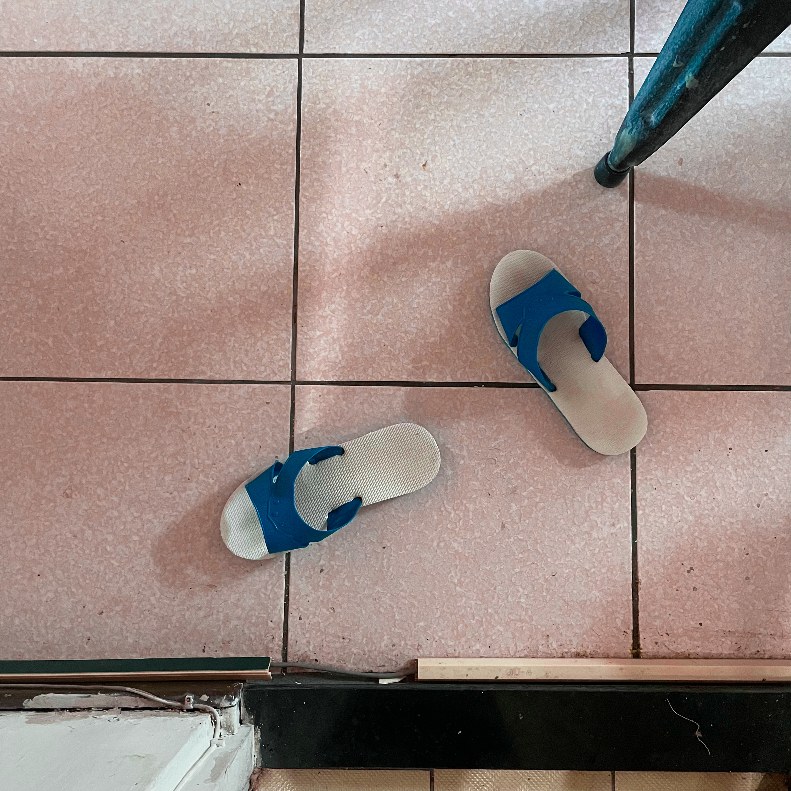
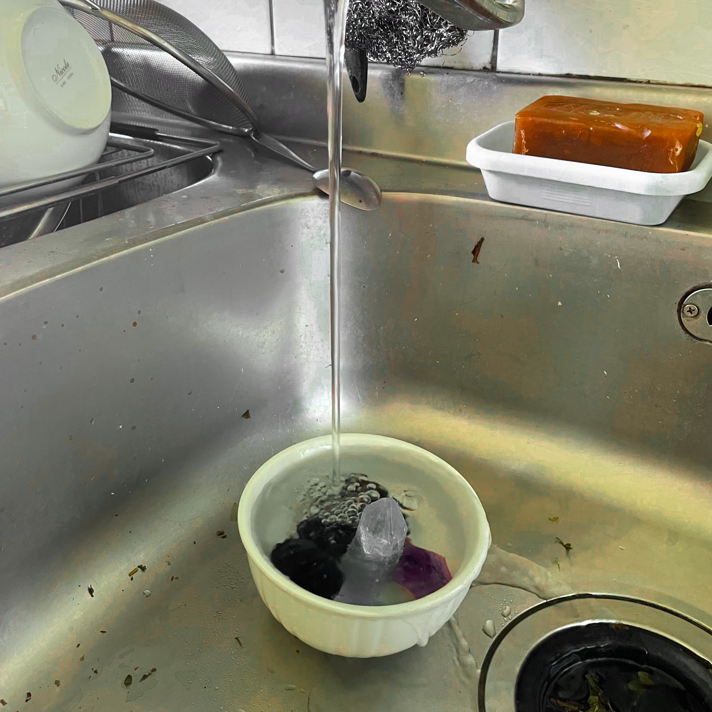
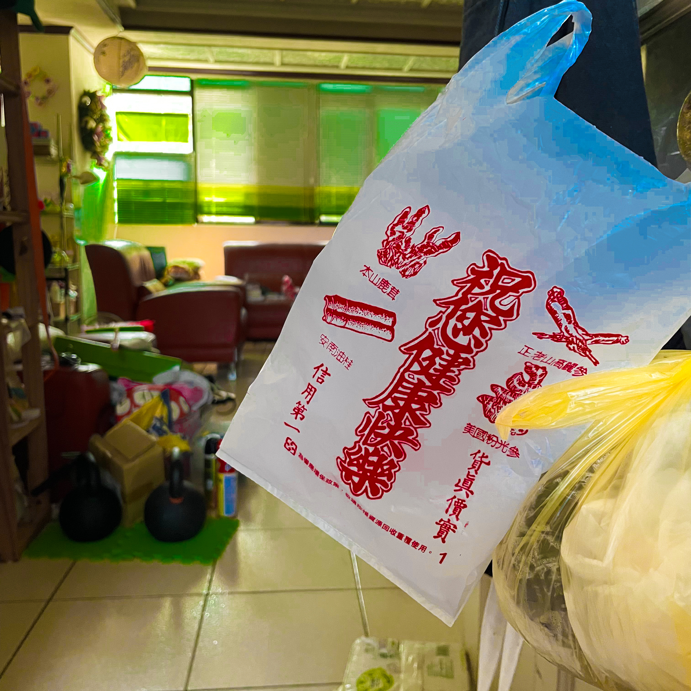
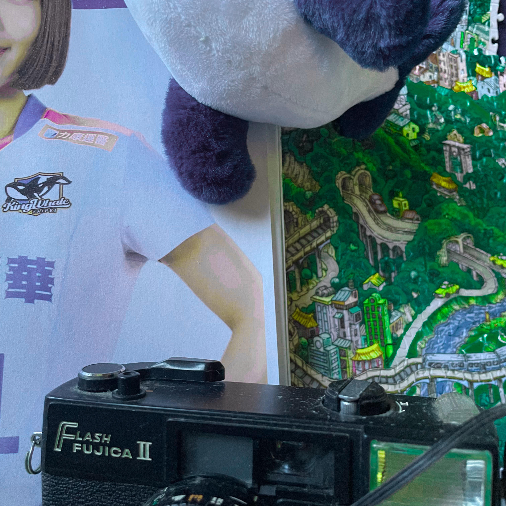
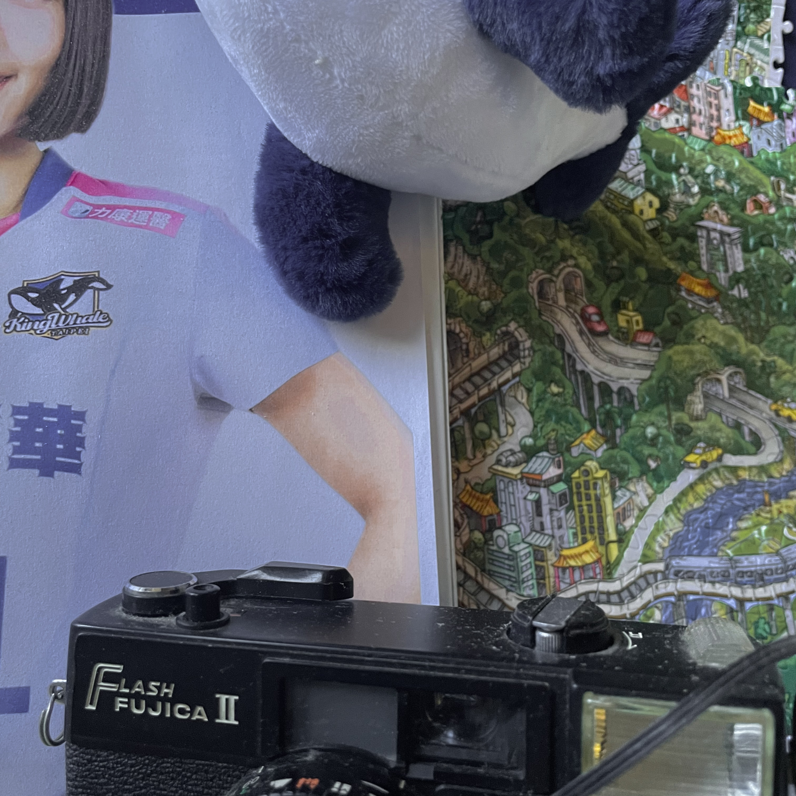
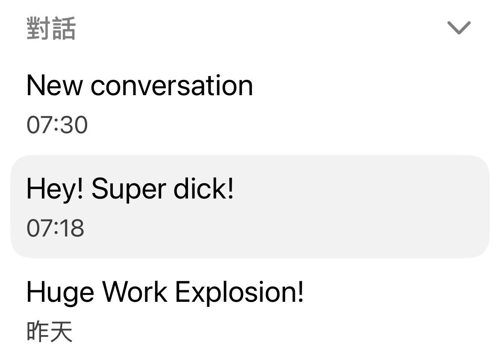

明度

***

以前調圖片都是打開來先調光，然後就一定是那樣調

今天發現先去調顏色

然後就是抓著滑桿（男孩最愛的那支搖桿

我找到一個安全的搖桿使用方法

去顏色混合

先搖一搖哪一個顏色動得最大

**然後不要動他**

像是按摩放鬆的「鄰近關節」，動他附近的，動他對面的

然後要動的時候也一樣，這個顏色動很大的話，色相先不要動

然後看飽和度和明度

影響比較大的就先不要動，

動其他的

照這樣的順序搖一搖

會比較整齊

反正就是照順序看哪一個影響大，就先不要動，先從影響小的開始調整

讚啦爽

然後「明度」聽起來好浪漫

而且通常是影響最小的，像是占星上的外行星

聽起來也像是羅蘭巴特

會在過馬路的時候被送牛奶的車撞死

如果ai的資料是來自於網路的話那為什麼我們不也多寫一些東西丟網路上這樣你也是在改變ai

