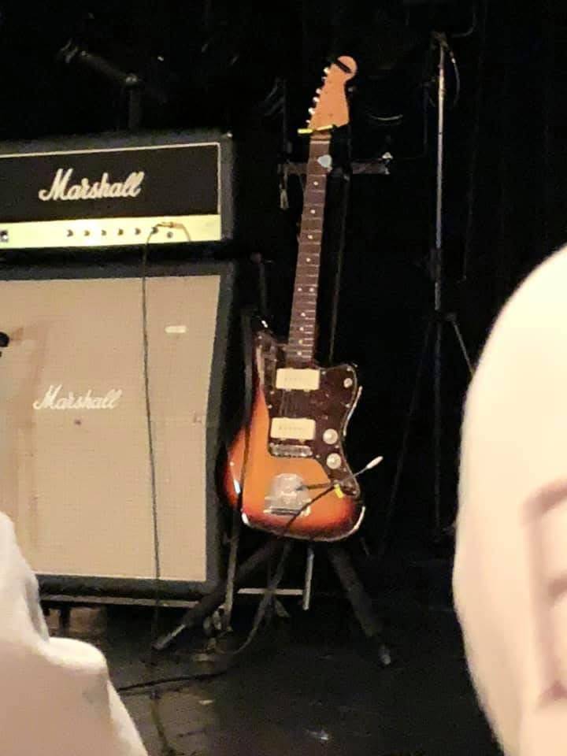
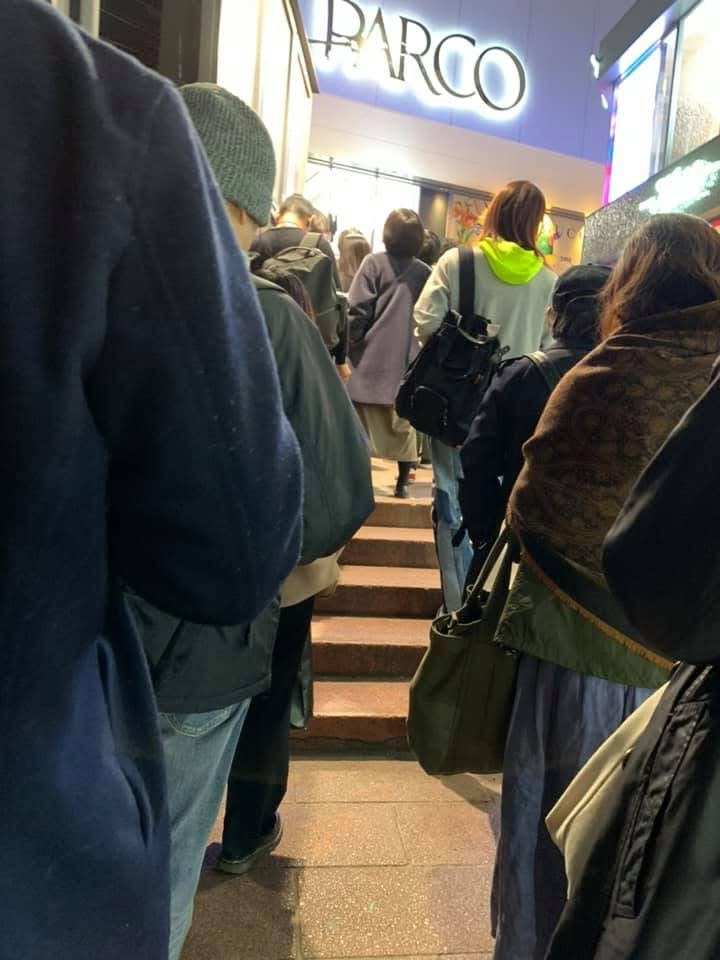
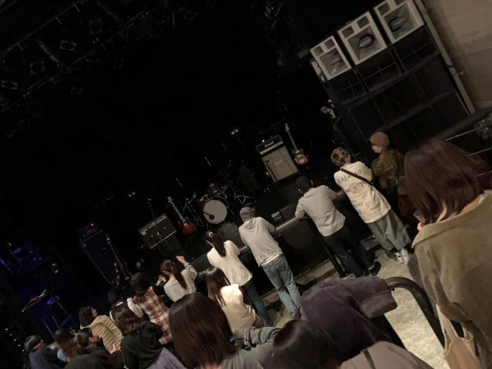
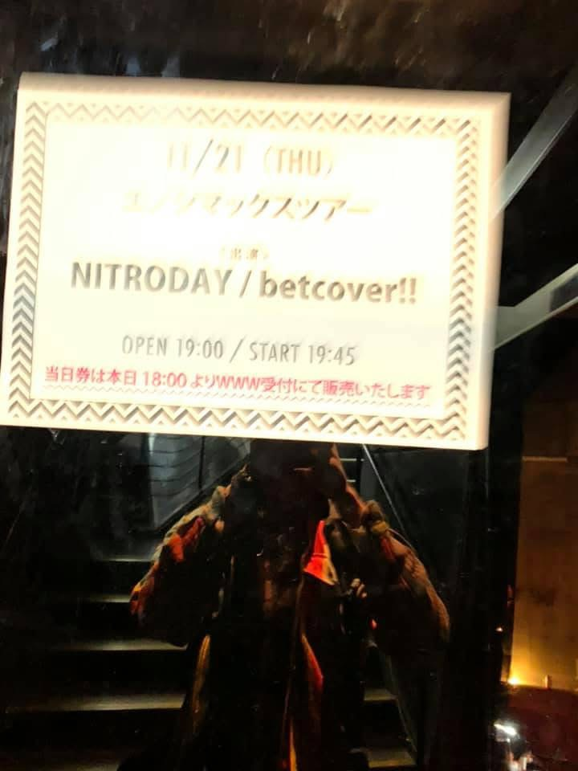
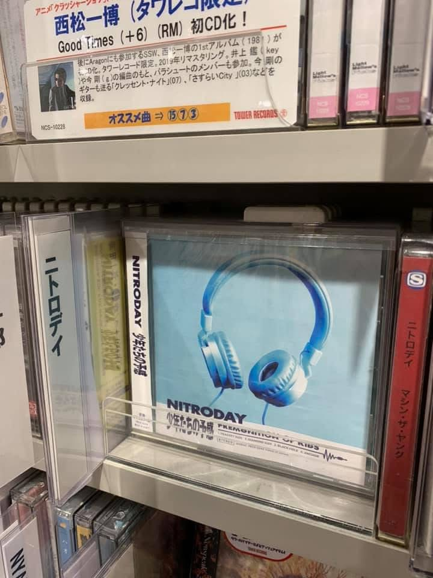
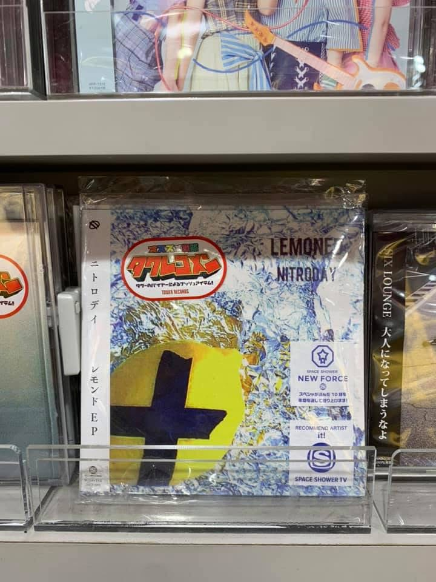
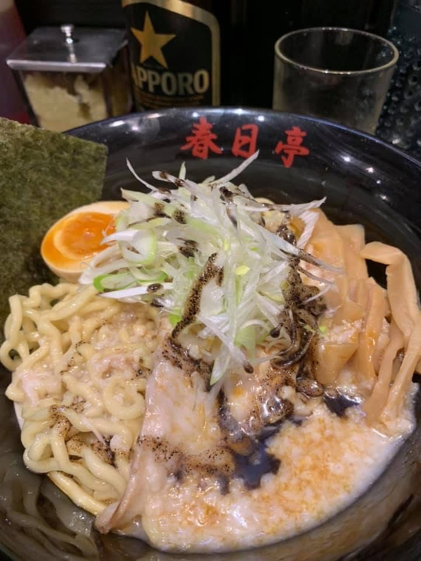
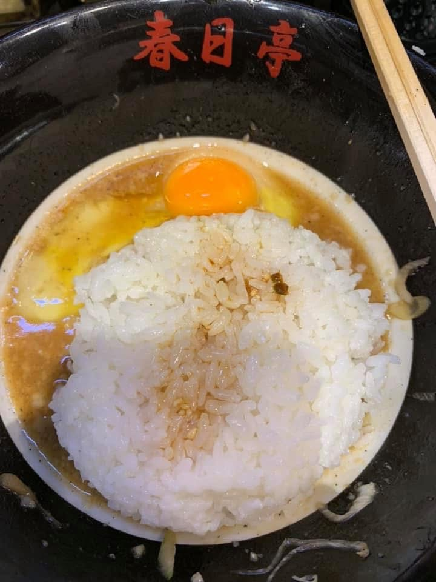

這篇文章記錄art-school要來台灣，彈吉他的yagihiromi的一些事情，以及NITRODAY，beatcover!!，以及春日庭的油そば。

This post is a record of art-school coming to Taiwan, some things about yagihiromi who plays guitar, NITRODAY, beatcover!!, and the abura soba at Kasuga-tei.

本文跟Gork協作翻譯。馬斯克的AI一起翻，上太空的地下樂團

This article was collaboratively translated with Gork. Musk’s AI helping translate an underground band that’s going to space.

art-school要來台灣

art-school is coming to Taiwan.

重點是yagihiromi

The point is yagihiromi.

***

ART-SCHOOL當然不需要我這種咖小介紹，我幫補充一環，右下坐著的是彈吉他的年輕的yagihiromi，她是樂團NITRODAY的吉他手。NITRODAY現在沒有在活動了，當年高中生成團做出了很屌的音樂——我在Spotify聽到覺得：

ART-SCHOOL obviously doesn’t need an introduction from a nobody like me, but I’ll fill in one missing piece: sitting down there on the lower right is the young guitarist yagihiromi. She was the guitarist for the band NITRODAY. NITRODAY isn’t active anymore. Back then, as high schoolers, they made some seriously badass music. When I first heard them on Spotify, my reaction was:

喔喔幹這個節奏好

Whoa, fuck, this groove is good.

喔喔幹主唱唱歌好難聽他被殺喔

Whoa, fuck, the singer sounds so bad it’s like he’s being murdered.

喔喔幹可是我停不下來

Whoa, fuck, but I can’t stop listening.

四個人，超棒的組合

Four people. An insanely perfect combination.

我超愛他們然後影片裡吉他手彈琴的姿勢超棒根本就是用身體在彈琴

I fell hard for the and the guitarist’s posture in the videos absolutely killer She wasn’t just playing the guitar she was playing it with her whole body.

我很喜歡所以有私訊幾次

I liked it so much I messaged her a few times.

一次她用（顯然比我好很多）英文跟我說希望我有機會看他們現場。（當然是某種日本意思的轉換

Once she replied in English (clearly way better than mine) saying she hoped I’d get the chance to see them live someday. (sure that polite Japanese way of saying it.)

我看了一下NITRODAY的行程突然重擊了一下，下下週在渋谷；我過年有一張去東京的機票，還是，我就⋯⋯

I checked their schedule and got hit hard—they were playing Shibuya in two weeks. I already had a ticket to Tokyo for Chinese New Year. So… yeah.

兩個禮拜後我在yagihiromi的正前方看她彈吉他🤗

Two weeks later I was standing right in front of yagihiromi, watching her play guitar. 🤗

11月的東京，連日細雨，鞋子濕了但可以一直走下去。後來NITRODAY沒活動大家有自己的活動的樣子，yagihiromi多做自己的吉他創作，在NITRODAY她是不唱歌的，唱歌的是魔性的殺雞主一直搖她那一大根（搖座，謝謝）是她後來多年來常有的樣子：翹著腳坐在某處的椅子上，滿地效果器，不說話吧，然後就用身體談起吉他。這是我常在她ig看到的畫面。後來也會看到她開始出現在ART-SCHOOL的活動裡，就這樣。

November in Tokyo, constant light rain. Shoes soaked, but you can just keep walking.
Later NITRODAY went on hiatus and everyone went their own way. yagihiromi started doing more of her own guitar work. In NITRODAY she didn’t sing; the demonic chicken-killing vocalist did that, shaking that big stand (thanks for the foot pedal, by the way). The image I often see on her IG these days: legs crossed, sitting on some chair, pedals all over the floor, not saying a word, then just letting her body talk to the guitar. That’s how it is. Later I started seeing her appear with ART-SCHOOL. And that’s that.

***

https://open.spotify.com/artist/5j34O3Q91uDakTczKEBneX?si

後來也有了自己的Spotify

Later she got her own Spotify page too.

***

https://youtu.be/DB0kKn-QYYA?si

萬物的起源是在台大後門118等飯糰的時候聽到這首歌。

The origin universe was waiting for an onigiri at 118 behind NTU when I first heard this song.

***

我當年玩交友軟體，一定會和別人推薦NITRODAY ，作為友情辨認器。如果2020年代妳曾經在柴犬上被一個男生推過NITRODAY的，那大概就是我。

Back when I was on dating apps, I would always recommend NITRODAY to people as a friendship litmus test. If in the 2020s some girl on Tinder got spammed with NITRODAY by a random guy, that was probably me.

***

https://open.spotify.com/track/4WGSsBDLYE25tEoa3RrZRi?si

***

https://youtu.be/cMLjenbdwKg?si

這首歌，很長，一定要看完。

This song, is, long. You have to watch the whole thing.

***

這首真的讓我覺得：主唱好像是一種樂器，通常操縱的方法是：踩著他的腳；揍他肝臟；捏他耳朵。就可以控制各種「rrrrrrrrrrrr」那樣。

This track really made me feel like, the singer is basically an **instrument**. The usual ways of operating: step on his foot, punch him in the liver, pinch his ears—and then could control all kinds of “rrrrrrrrrrrr” sounds.

***

https://open.spotify.com/playlist/45G7hlZRf0c1jCdvup6Dcq?si
分享我的抗厭世上班播放清單：只有兩首歌幹笑死
My anti-existential work playlist: just two songs.
Fuck, I’m dying.

***

這首歌的檸檬，是梶井基次郎的檸檬。

***

我找一些我當年有看過的、NITRODAY的影片，不是他們官方的。

有幾部我看過已經不見了。我記得他們是高中組成的團，橫濱的樣子，參加比賽得了獎。

YOUTUBE上有過比賽的影片但已經找不到了

https://youtu.be/5--OKSWe-YY?si=1HWgzWYfwm7pZ-W5
https://www.youtube.com/watch?v=iG0-saJV5AI
https://www.youtube.com/watch?v=tvZOGnJHbDE

他們練習的側拍影片

以下是我當時去看表演的記錄

---

2019年在東京演唱時，yagihiromi的吉他XD

這場我沒有拍她，因為我都用看的XDDDDD

入場前的排隊：

像小山城一樣的shibuya WWW前面，排隊排一排，他們從我旁邊走上去，yagihiromi穿著棕褐色的襯衫外套

開場前

共演是beatcover!!

https://www.youtube.com/watch?v=Gy63a8APe64

別人的紀錄

是下半場，但因為我太餓了就離場，地下室的www樓梯下方有擺攤賣周邊，NITRODAY攤位的工作人員不在，隔壁的人跟我說他馬上會回來。我只買了兩張專輯。

在某間唱片行還被亮出來的時候

嶄新的檸檬

我中間先逃走了，想找東西吃，先看到沒有人的一蘭（笑），走了幾步之後看到春日庭。一直想吃看看日本的油そば。最特別的是，吃完之後可以加點白飯和醬汁。我本來只有點麵，看到隔壁課人家點看起來超好吃，就請店員幫我加購。米飯裹上吃剩的湯汁加上生蛋和特製醬汁。有夠好吃rrrrrrrrrrrrrrrrrrrrrrrrr

https://youtu.be/Z5VnxM-W9-0?si=atuTNfnvpj_ZwmVm

別人的影片記錄

### as i remembered

我記得我找過NITRODAY大概最早期的影片們，他們一開始是高中（記得是橫濱的）組成，然後參加表演得名

NITRO記錄
ニトロデイ
關鍵字下：ニトロデイ比較好找，然後有一些是其他熱音社cover他們（哇是別人cover的對象了

想找他們早期影片，我有看過

https://youtu.be/x8UyX264AJ0?si=5f4_IaJu4PPzySKl
ニトロデイ LIVE at 横浜 BB STREET
環七フィーバーズNEO

https://youtu.be/4lxHW1HGZD0?si=HdIKzqdePkvbZcGy
受訪的影片
ジロッケン#66後編/ ニトロデイ
環七フィーバーズNEO

---

阿她另一個團是cruyff

---

