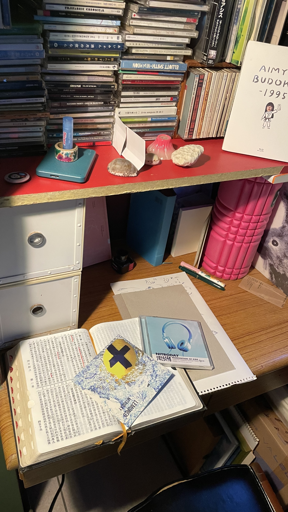
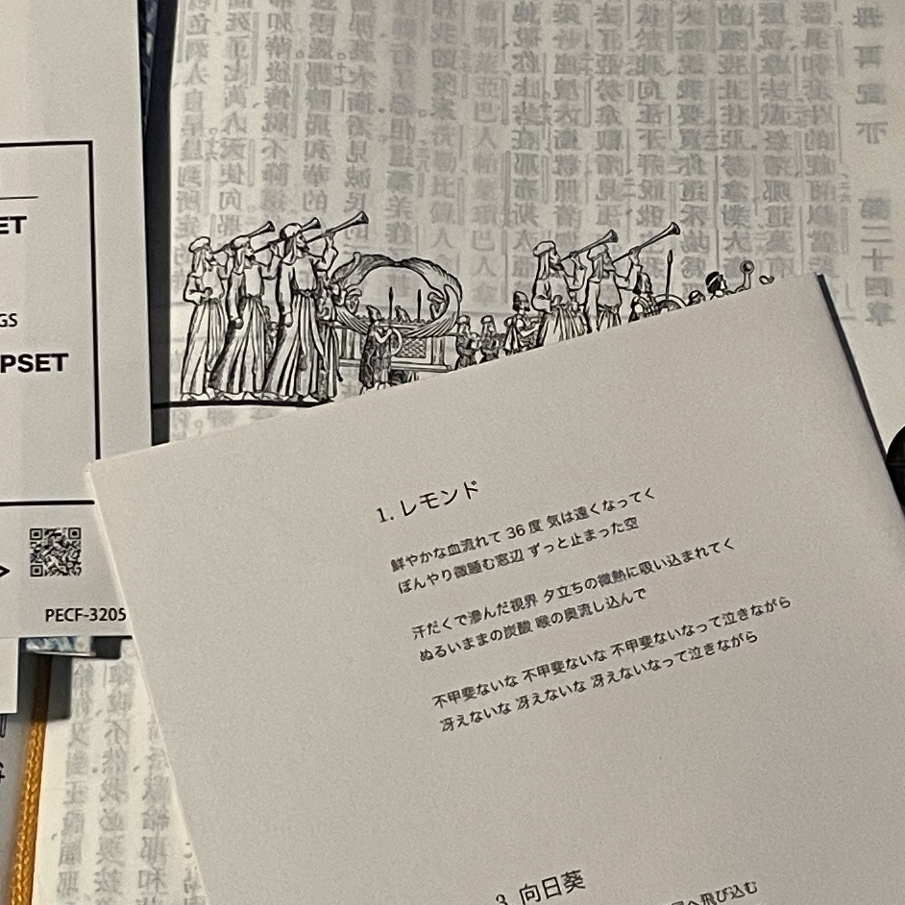

art-school要來台灣

重點是yagihiromi

天！我現在才知道這個，ART-SCHOOL當然不需要我這種咖小介紹，我幫補充一環，右下坐著的是彈吉他的年輕的yagihiromi，她是樂團NITRODAY的吉他手。NITRODAY現在沒有在活動了，當年高中生成團做出了很屌的音樂——我在Spotify聽到覺得：
喔喔幹這個節奏好
喔喔幹主唱唱歌好難聽他被殺喔
喔喔幹可是我停不下來
四個人，超棒的組合
我超愛他們然後影片裡吉他手彈琴的姿勢超棒根本就是用身體在彈琴
我很喜歡所以有私訊幾次
一次她用（顯然比我好很多）英文跟我說希望我有機會看他們現場。（當然是某種日本意思的轉換
我看了一下NITRODAY的行程突然重擊了一下，下下週在渋谷；我過年有一張去東京的機票，還是，我就⋯⋯
兩個禮拜後我在yagihiromi的正前方看她彈吉他🤗
11月的東京，連日細雨，鞋子濕了但可以一直走下去。後來NITRODAY沒活動大家有自己的活動的樣子，yagihiromi多做自己的吉他創作，在NITRODAY她是不唱歌的，唱歌的是魔性的殺雞主一直搖她那一大根（搖座，謝謝）是她後來多年來常有的樣子：翹著腳坐在某處的椅子上，滿地效果器，不說話吧，然後就用身體談起吉他。這是我常在她ig看到的畫面。後來也會看到她開始出現在ART-SCHOOL的活動裡，就這樣。

***

https://open.spotify.com/artist/5j34O3Q91uDakTczKEBneX?si
後來也有了自己的Spotify

***

萬物的起源是在台大後門118等飯糰的時候聽到這首歌。
https://youtu.be/DB0kKn-QYYA?si

***

我當年玩交友軟體，一定會和別人推薦NITRODAY ，作為友情辨認器。如果2020年代妳曾經在柴犬上被一個男生推過NITRODAY的，那大概就是我。

***

https://open.spotify.com/track/4WGSsBDLYE25tEoa3RrZRi?si

***

https://youtu.be/cMLjenbdwKg?si
這首歌，很長，一定要看完。

***

這首真的讓我覺得：主唱好像是一種樂器，通常操縱的方法是：踩著他的腳；揍他肝臟；捏他耳朵。就可以控制各種「rrrrrrrrrrrr」那樣。

***

https://open.spotify.com/playlist/45G7hlZRf0c1jCdvup6Dcq?si
分享我的抗厭世上班播放清單：只有兩首歌幹笑死

***

這首歌的檸檬，是梶井基次郎的檸檬。

