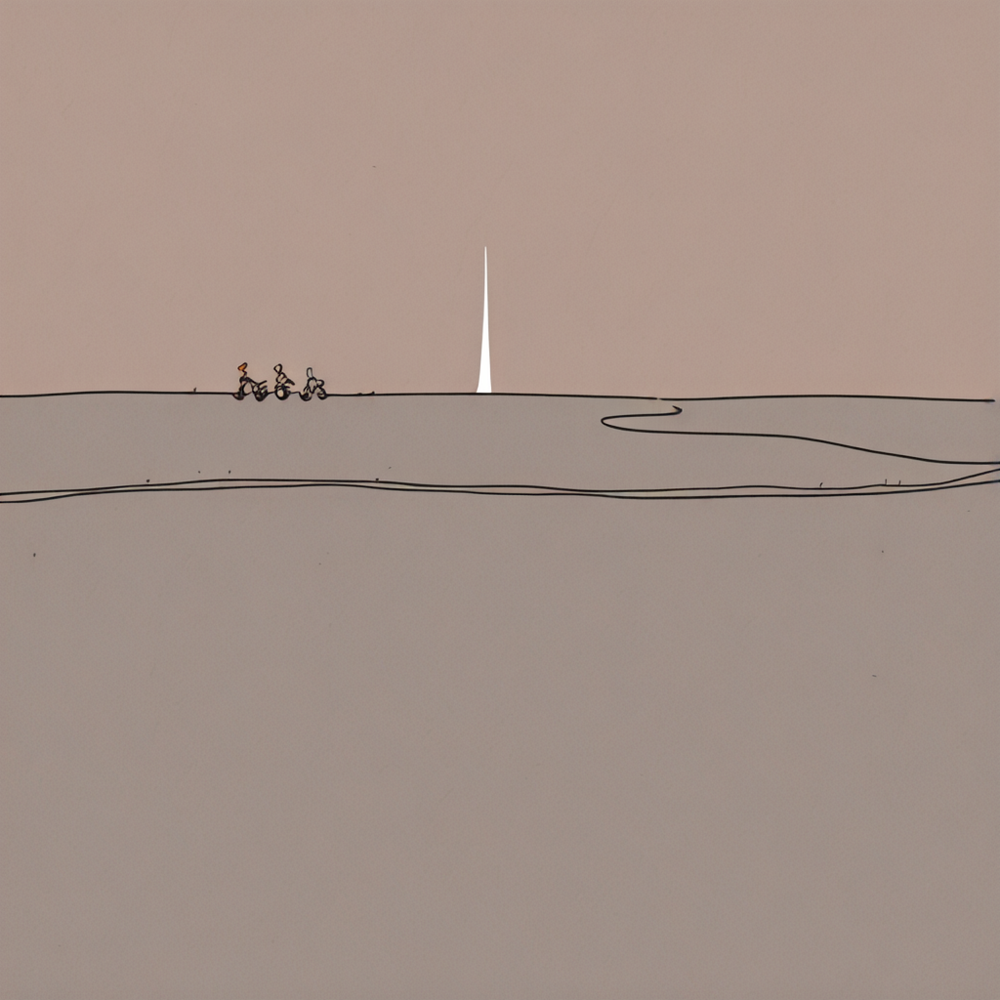

ART-SCHOOL

スカートの色は青

nlxl
steps28, cfg2.5,2sa, beta57,

嬸嬸要我推薦ART-SCHOOL的歌

我看了一下spotify

每一張我都聽過但我只有按這首讚

Auntie asked me to recommend an ART-SCHOOL song

I took a look around on Spotify.
I’ve actually listened to every album, but the only one I hearted is this track.

——

（聽說現在ai都用破折號我也試試看

這首歌的畫面是——

很粗大（？）的公路上

貝斯蹦蹦蹦的一路上

吉他開出很多渲染的雲朵細細

細細筆直的小路下坡，通往海邊

不知道為什麼星期天下午都沒有人的村落

新建的兩層樓民宅有電視的聲音

島的中間是草地，筆直的樹和電線桿

有時候路邊會有牛站著看你騎車過去

——大概是這樣的畫面

ART-SCHOOL

スカートの色は青

（I heard AIs these days love using em dashes, so let me try too）

The imagery this song paints is——

A wide, thick, slightly wild highway stretching endlessly ahead.
The bass thumps like a heartbeat — boom, boom, boom — hitting you right in the chest.
The guitar tears open the sky and draws cloud after cloud, soft and wispy at the edges.

The road begins to slope downward, narrow and straight, sliding directly toward the sea.
A Sunday afternoon village, strangely empty, almost no one around.
In the newly built two-story houses, the faint sound of television drifts out — blurry, ordinary life.
In the middle of the island, stretches of grassland, straight trees and utility poles standing like silent sentries.
Occasionally, a cow by the roadside stands still and watches you ride past, its eyes seeming to say, “Oh, you’re here too.”

Something like that.

ART-SCHOOL
スカートの色は青
（Her skirt is blue）

——

本文由馬斯克的X沒有贊助翻譯（有翻譯沒贊助

---

Her blue sky

flat illustration, color block style, simple clean lines, minimal details, bold flat colors, 

a lonely girl riding a bicycle on a wide empty highway that slopes gently down toward the distant sea, her bright blue skirt fluttering wildly in the wind glowing under sunlight, long flowing hair, 

endless wild road stretching into the horizon, patches of grassland in the middle of a quiet island, straight utility poles and trees standing like silent sentries, 

a single cow standing by the roadside calmly watching her pass, 

newly built two-story houses scattered in the background, faint television glow from windows, empty Sunday afternoon village with almost no people, soft warm light, 

vast open sky with soft wispy clouds being torn apart by wind, melancholic yet liberating atmosphere, sense of freedom and solitude, 

flat color palette, illustrative, graphic novel style, simple shapes, bold outlines, minimal shading, clean composition, artistic, serene yet emotional, qup3j6,

