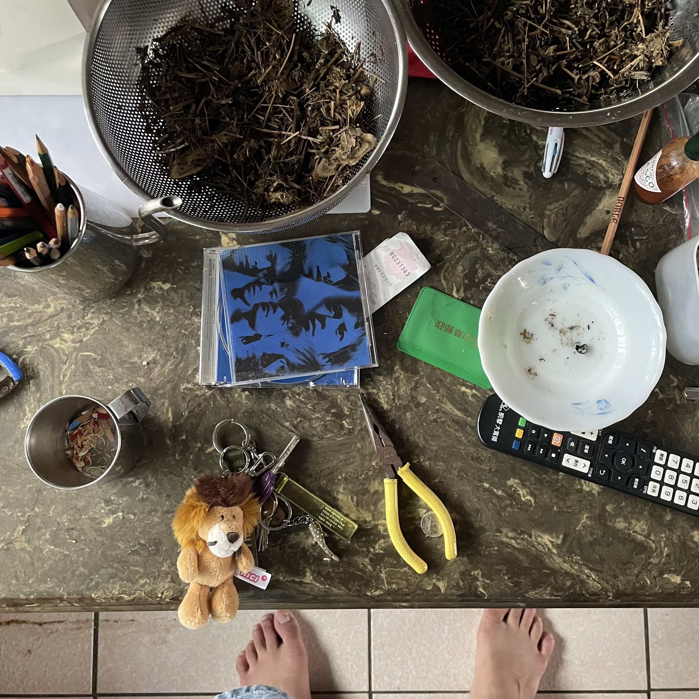

去我爸那跟倉庫一樣的舊房間找工具，沒找到

找到一疊老CD「啊原來他還留著這些啊」（並沒有要進入感傷

藍色的是當年的正版Ｖ6精選輯

國中的時候，偶爾會有一次有廠商帶著ＣＤ去合作社社賣（現在以大人的角度可以理解這個workflow

但國中的時候只覺得很爽，很像大人，下課鐘一打就拿著錢「誒，（抬下巴一下），去合作社了」

都是去合作社了，但這次買的東西比較屌，這樣。

幹待會來聽一下這張，

我爸在屏東的安養中心有點無聊，手機被我媽搞掉那個女人

我跟我嬸嬸說，跟我爸說，我問他，那個做東西用的銀色座子，夾東西用的那個，現在被收在哪裡啊？

他會跟我解釋，這樣他在輪椅上就有事幹了

Q.E.D.ę

