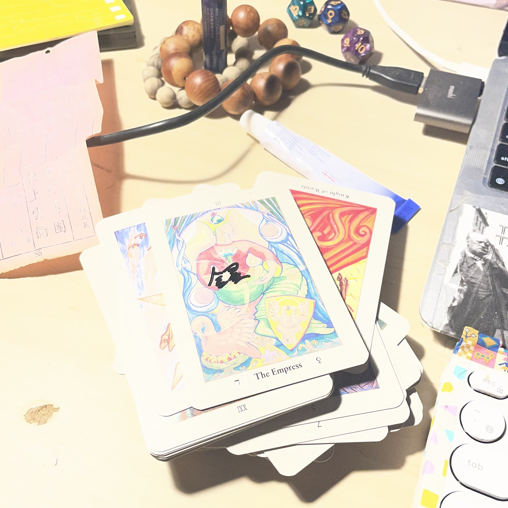
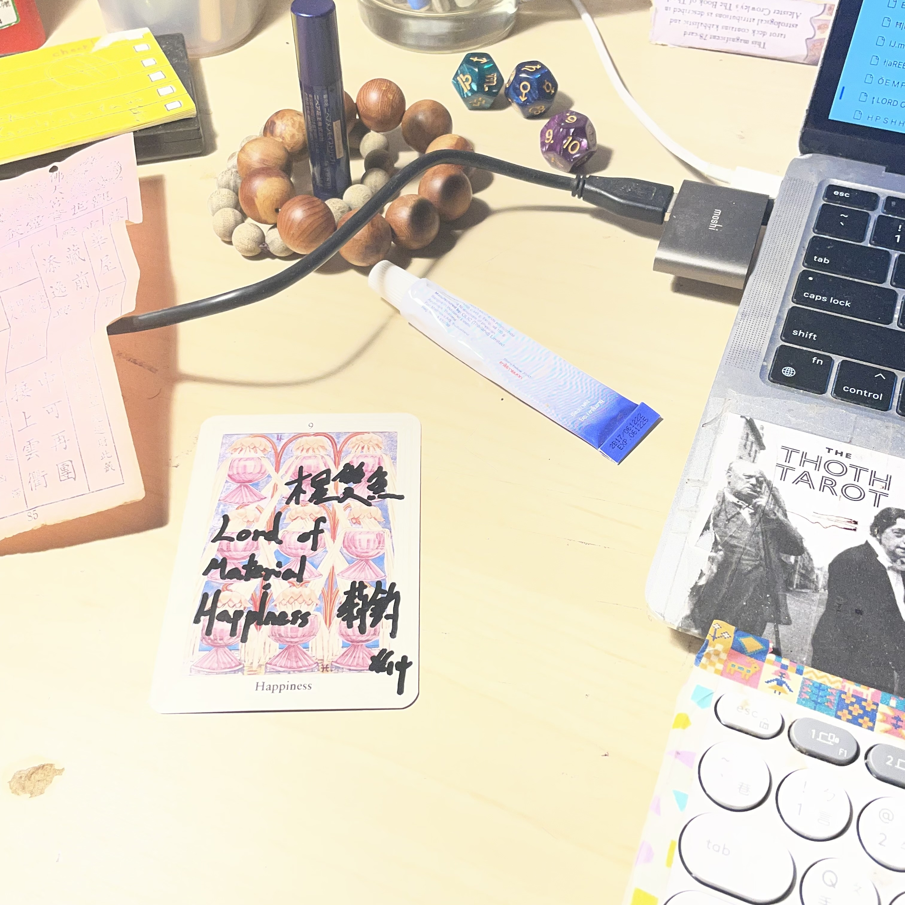
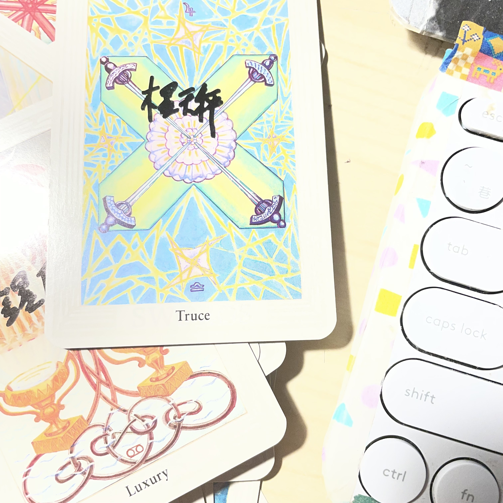

Ӵ 練習，想事情做事情讀事情的時候移動身體

放個音樂隨著節拍移動，

「用身體的那些點」

去打

「空氣中因為音樂而來的那些點」

打一點點也好去注意那些點

去想像、創作那些點

你就會像麥可傑克森

而且對大腦好

聽說的

Q.E.D.

https://open.spotify.com/artist/6sAONleCsmAyP87OHsVAPV?si=wwQCOl8vSGWlLT_Fce8Lrg

今天晚上聽的

在脆上面發文，很少看到這種格式了

就是文章有歌有圖，不用另外點進別的地方

我比較習慣這種東西

不然很奇怪

ţ

而且我在讀的是我今天早上在我家附近的廟抽到的籤

今天台北嘉興地區宮廟故事：

（這裡只是嘉興街而已謝謝）

「你一直丟祂就沒有要給你啊」

「呃」

「祂一直那樣就是沒有要給你啦」

「呃喔」

「祂一直 Ѭ 那 Ӂ 樣 Ѭ 就是 沒 有 要 給 你 啦 」

「他有要給我」

「љ，那一個就好啦」

「我跟他們說三個」

「一個就好啦啊啊啊啊啊啊啊啊啊啊啊啊啊啊啊啊啊啊啊啊啊啊啊啊啊啊啊啊啊啊啊啊」

「好  哈哈  好」

就是七王爺不都要三個聖筊嗎，我就跟神明討論說那就「是這隻籤的話請給我三個聖筊」

程式設計的邏輯跟筊，好像

再一次，工程師喜歡綠色乖乖

然後神明已經答應要給我籤了

但常常一個聖筊後就陰筊

還有一次有一個跑到前面那個椅子下面

這家的筊掉地上的聲音很軟

這間廟的氣氛很軟

我早上去逛另一間，我們這邊大家都會經過的地方，我小時候不喜歡他們，長大還是不喜歡，大概介於討厭和喜歡之間屬於「沒有喜歡」

那邊感覺是「荒郊閒散阿伯俱樂部」

簡稱阿伯勒

現在這一間是ＴＨＥＥＭＰＲＥＳＳ（注：我剛剛重讀檢查的時候，想說這邊在寫三小？喔因為我第一次忘記The Empress怎麼寫，笑死

托特塔羅的金星

我昨天發現因為托特牌牌面都一樣沒有二創

所以我要記但從來沒記過的東西我乾脆

就用油性麥克筆寫在上面

讚，爽，一目瞭然，用棋靈王的手勢抽出來砸在桌上的時候有一種喔喔喔喔喔喔喔呀一～～～～～～～～

「**金星**」

對那兩個字是金星

托特塔羅可以看占星，因為他的牌義有來自占星‘數字’（我開始覺得按這個當標點比較方便

還有卡巴拉（然後還有一堆寫他們圖像的書

喔還有克勞利本人幫他們取的**Debauch**之類

聖杯九根據占星，是木星雙魚，雙魚座十度，到二十度，三月一日到，三月十日

聖杯九是木星雙魚，

LORD OF ＭＡＴＥＩＡＬＨＡＰＰＩＮＥＳＳ

啊，誰是三月一號到三月十號生日啊，是臺北鯨華陳莉鈞

＿＿＿——＿——ґ，所以通常的玩法就是也可以看這些占星的東西我完全不懂

我朋友是古典占星專家，我有買書，懶得看

我是權杖五

我有發展過「**托特塔羅配對**」誒，我問過兩隻ＡＩ都説沒聽過這種東西（**ＡＩ的正確使用方式＊＊）

這邏輯是，我現在抽一個，圓盤十對寶劍四，

圓盤十：水星, 處女,

寶劍四：木星, 天秤,

所以如果你是圓盤十，對方是寶劍四，你們接近的時候

就是**你的水星進到對方的天秤**

聽起來滿平穩的

就是你會覺得平穩

而對方是，他的木星進到處女

......怎麼解啊，我通常就是敲敲我的古典占星好朋友我現在要怎麼唬爛下去？

總之就是他會有一種「木星進到處女」的感覺，ＹＥＡＨ

就是這樣的邏輯

ＧＩＴＨＵＢ上第一次出現這種土炮但是**你好像很難說這個原理有問題**的東西

這種東西

AI

做不出來。你用ＡＩ協作，也，做不出來。Ӻ

我喜歡這種東西，所以我寧可看人家在香菜裡加皮蛋而不是皮蛋裡加香菜

喔我抽到的籤

紙質很好

讓我想到在日本，吃拉麵，自動售票機，吐出來的紙片，厚厚的，印著字，交給老闆，又被收走了

好想要喔，好酷

喔我拿到聖筊去放籤的櫃子錢但被透明塑膠布封住阿姨走過來跟我說抽到幾號幫我拿

這次的聖筊很乾脆，只是他一支趴在我穿藍白拖的大拇指上

像是圓滾滾的什麼小東西攀上來

八十五

之後阿嬤拿出邊緣泛黃的籤，軟軟的紙，

讓人記得軟軟的紙的是夏宇的《腹語術》

唐山書店地下室｜地下室唐山書店

重開山後藏前事

萬寶源中可再團

醉詠新詩添逸興

貴人引接上雲衢

好粉紅色的籤

籤本身真的是粉紅色的紙謝謝

想起餐廳桌上的粉紅色衛生紙，正方形的

自身 謹 防

恩有啊

訟詞 反 覆

幹親愛的原告大大

我跟我朋友說’就是那個古典占星仔

她最近在寫稿，今天在別人的新書發表會

還是研討會，不知道

下次幫她抽

妳把你的ＰＲＯＭＰＴ整理好之後給我

喔那我現在就幫妳抽一張好了

妳各位啊

（洗牌）

你有看過有人線上，直撥，抽塔羅對吧，那有看過文字版本嗎？

（親，為你洗牌中）

**顯示為切牌**

筆記：

hahahahaaaaaTOdeaTH.md
廟的故事，大的版本：Ħ|temmmmp.md
廟的延伸發展，還有壺鈴，：IJ.md

碎念筆記（你該不會真的把這個當網誌吧？

發展？Ӣ，

設計法則與現代詩：寫現代詩的方法，

其他人的，我不知道

我的詩怎樣我也不知道

我只能說

鯨向海喜歡過我的詩

＿＿--_-----_——（這個是破折號的意思）——＿—鯨向海喜歡過我的詩

不錯吧，這種修辭，比較級，醉大及，罪大惡極

AI協作，寫不，出來ㄓ

也就是這樣把詩用鍵盤寫出來，然後用設計一樣的邏輯

這邊太鬆了

這邊對齊

好處是我們的方塊比較大

不小心砍掉也比較好復原

讚讚讚
讚讚讚
讚讚讚

靠北喔幹像今天這首，寫得就很緩所以，我想說我剛剛有寫過托特配對那一段嗎，幹在哪裡啊我這樣刷一刷找不到

第一次有需求去開歷史紀錄

才找到了，本段落，沒有，被刪除，他好好的在那邊，純粹是，我 ㄆ一ㄚˇ 眼了

我們來互交，互交ＧＩＴＨＵＢ，聽起來有點色，詩交呢？

啊下次可以講我發明（ＡＩ，沒有，協作）的

Ѽ 托特塔羅數字學牌陣法 Ѽ

很簡單（茶

下次直播的時候，大概一半的時間，就可以教完大家

什麼的一半，的時間？

我也不知道

總之，

重開山後藏前事萬寶源中可再團

醉詠新詩添逸興貴人引接上雲衢

蘇秦 抵 掌  華 屋

以防大家沒看過不是業配的正常人在網路上寫的文章，我們那個年代很多這種的
Q.E.D.

（啊還有可不可以看「兩個中文字排在一起看起來就比較香」這樣用視覺的方法來呈現現代詩就是現代詩Ｘ設計

在threads上面用————

喔然後教你怎麼寫詩aka使用文字aka跨足文案行銷雖然我不喜歡行銷aka教你怎麼用打字的在網路上妹子聊天跟 原ＰＯ 一樣把妹把到人財兩失

聖杯騎士，的相反

喔然後我再加上，心理諮商，比如說面對

「那你毑肆壱下為什麼你要這養血」（我在表現說這個人有個雞巴洨口音

「你這邊想要表達的是什麼意思？」（很累不想要這樣表現第二次

面對這種問題你可以說，

施主

關

 你他媽，個雞巴毛事情啊，

 怎樣不錯吧視覺化的文字構連行銷心理諮商讓你縱痕職場情場台北高雄兩地每週一場一期五千終身課程二十萬大洋永久免費附贈85大樓星空無邊際游泳詞落望保祿二世早餐下午茶免費大波露無限供應

侎

忘記要講什麼事情了

還 有 一 個 是 怎 麼 jam 一 堆 瞎 雞 巴 文 字 （ 我 幹 過 （ 自 己 在 房 間 用 手 機 錄 音 （ 很 土 炮 的 氣 氛 （ 自 以 為 宋岳庭（文字配上你自己用ＳＴＡＢＬＥＤＩＦＦＵＳＩＯＮ寫ＰＲＯＭＰｔ而且是ＡＩ協作的喔（意思是ＧＲＯＫ幫你寫出ＰＲＯＭＰＴ不過你當然她媽的要自己一個一個看啊

還可以教你們怎麼打出上面這一行東西

用身體

加入身體韻律

你的身體，手指頭，連結到，你的海底輪你的海底蝦機巴，搖晃你的媽媽你看海底有好大一輪巨大蝦機巴

 喔我們以前在ＰＴＴ詩版ＰＯＥＭ鬼混的，那時候大家很流行推文推 

 你有看到嗎？ 

 就是一個他媽的空格這樣才會發出去但發出去是空格，

 ＣＭＣaka四處常見體質的台師大噴泉詩社成員本名CMC，

啊幹我是噴泉詩社的，我都忘記我有這種體值血統了

ＣＭＣaka四處常見體質的台師大噴泉詩社成員本名CMC

簡稱ＣＭＣ

有一次在誠正勤樸忘記哪一棟大樓的廁所樓梯間的那種上完小便斗洗手大便間有人沖水完 穿好褲子 出來，我也剛好抬頭，對上眼，靠北怎麼又是你

前幾年忙一個轉型正義的大案子（是我們將這個蝦雞巴資料庫稱作為「案子」，不是「我們是這個案子裡的一部分」的意思）的時候————

我覺得還可以出一個課程就是用鍵盤打中文字來寫指令，教你怎麼他媽的精修你他媽的指令

幹所謂指令就是

你現在想像你有一個師大國文系畢業的同事

他居然是工程師

幹他媽很屌

可是有點聽不懂人話

幹你他媽就把他(AI)當人，ＡＩ既然那魔想當人你就把他當人相處也可以不然就是當成靈體比如說佐為

喔我剛剛想到我現在簡直是在表演傳統技藝，跟那個，那邊那個用鍵盤寫ＣＯＤＥ的公成詩（工程師

是文學營第二天下午的講師嗎幹他媽雞巴

幹我以前聽到網路文學是，我是1990年生的，我出生的時候剛好是網路文學方興未艾的年代（一個操他媽瞎雞巴文獻回顧的口吻

所以我們之於網路文學，你有聽過新聞，還有那個什麼，我忘了，嗎？

就像是現在的年輕人之於我們

幹

滿屌的

以前聽**那些事情**都已經是**上一個世紀的事情**

蝦雞巴，我們在中文命名的時候，可以考慮他筆畫的鬆散，比如說蝦和雞都比較緊，後面加一個巴有一種角落小生物炸蝦的感覺角落小生物角落小雞巴角落小蝦機巴

讚吧

這邊可以邀請他媽師大國文系的同學來**科普**一下國學，

我和國文系學妹在圖書館約會，她把毛詩和一隻紅筆丟給我要我點我說我沒學過啊他說你就點啊隨便點

然後她就趴下去睡覺

「她把毛詩和一隻紅筆丟給我要我點我說我沒學過啊他說你就點啊隨便點」這樣ㄝ！

然後我就亂點了半頁也覺得很無聊，就牽牽她的小指頭

讚吧

才華洋溢啊，蔡藍欽唱說，或許你不能相信

我會的花樣還真不少

藝術外文繪畫和舞蹈 我還會電腦

根據專家的研究報告 學習要趁早 遲了就不好

如果本領不夠 將來想飛也非不了

誒幹，剛剛說到ＣＭＣaka四處常見體質的台師大噴泉詩社成員本名CMC結果就忘記了

你看我用ＧＩＴＨＵＢ寫，我可以輕易往上拉看一看操他媽**剛剛寫邱懋景的地方幹在哪裡我忘記了**然後若無其事接上來

我是說那時候我和一些人在搞一個轉型正義資料庫as an FFFFFFFHUGGGGGGGGㄅ ㄚ 大 案子，

同事很漂亮，我喜歡他，我編碼的時候都從螢幕上緣跨過，看她，用我灼熱的眼神將她的臉龐燒你他媽瞎雞巴閉嘴，

同事是Ｔ大台文所畢業的，請問這樣有匿名到嗎？

我們上班都在聊天，很幸福，有天聊到他也認識邱懋警，誒不對我剛剛有匿名，這時候呢，我們可以開啟ＧＩＴＨＵＢ於西元兩千二零年代最先進的的「尋找功能」來處理這個問題

教你怎麼建個蝦機巴workflow

喔那我懂了，那這一切是一個關於「不插電寫作」

就像是阿強和烏鴉在海邊的卡夫卡的B級精選

https://open.spotify.com/album/6Y6hccWm1w4Y5xU7yjVgMm?si=PoZr8eqfRFak53BaEQYnkQ

我真的可以帶機械鍵盤去，青軸的，不然現在的年輕人，都不知道「在辦公室用青軸鍵盤」是什麼梗了

讚喔喝tequilla倒立

邱懋警的空格

^^^^^^^^^^^^^^^^^^^^^^^

重要重要重要重要重要重要重要重要重要重要重要重要重要重要重要重要重要重要重要重要重要

你看，這邊，我剛剛在下面寫了**邱懋警的空格**意思是說，我記得邱懋警有個關於空格的雞巴洨事情

但我待會再寫，所以我就在下面隨便找個地方寫下去，寫個筆記那樣

這樣你一路寫下來，就會遇到**邱懋警的空格**這種倒霉的事情

視覺上，體感上，很像是**你自己種的音樂盒**

邱懋警就說（誒幹請問你現在是有要匿名嗎？），他說，我真的不懂你們推文堆個空格到底是要幹嘛啊，有什麼問題就討論啊，真的是不懂你什麼意思椰

我和凱文（我是凱涵，他是凱文（後來的工作我是凱涵，她是涵婷，在後來的工作，我是梁凱涵，正職的大人們都以為陳凱翔和梁均純（不確定怎麼拼）又在搞事了

因為是把陳凱翔拆成：陳 凱翔

因為是把陳凱翔拆成：梁 均純

然後組合成「梁凱涵」這個虛擬新同事

這很像這兩個人會幹的事說真的，但這不是真的，因為我是真的，幹

幹而且這種鳥事情只會發生在唐山書店啦，誰家打工地方會有人**可能幹這種鳥事**（幹他們真的幹過鳥事）然後誰家打工地方的大人**會這樣子懷疑**底下的員工啊？

總之這很布西亞他媽Simulacres我可以教大家怎麼在這個年代依然認真讀**紙本書**畢竟你們跟我們曾經是敵人現在我們都差不多快死了

賴曉黎說研究生一天要唸書八個小時一本書要唸三遍第一遍略讀，第二遍精讀，第三遍跳讀。

略讀是什麼，他說，從第一個字看到最後一個字，目的是，讓你知道這本書大概在講什麼；

；

我就他媽的很想用分號幹，來，我他媽還教你們怎麼用分號勒，幹一堂課收你2200啦十年前1600現在川普害的

略讀是什麼，他說，從第一個字看到最後一個字，目的是，讓你知道這本書大概在講什麼；

精讀是什麼，他說，你就他媽一段一段讀啊，給自己寫摘要這一段在寫什麼，然後，讀不懂就給我想辦法弄懂，目的是，讓你知道這本書大概操你他媽在糾結什麼雞巴洨啊幹煩死了；

最後還要跳讀，就是，跳著看「你需要的」地方，「**你需要的地方**」，再看一次，就，把搾過汁的再搾一次

好，我為什麼要講這個，有點ＰＴＳＤ，要開始賣心理諮商的課了嗎？這時候我們可以放輕鬆，

輕易滑順的往上，看看自己，看看自己，挺高尚，這是來自嘉義的美秀集團，來自我忘記是哪裡的懋警，點了這首歌給凱涵，台北的凱涵，說，你他媽別再鬼扯了，

好我們擬訪物的擬物這時候切換回去如此滑順，剛剛在講什麼，這時候我們可以往上看，慢慢地看，用眼睛看，也可以像達康，用人中看，這時候你一個人半夜用電腦慢慢地打字，調整呼吸，正念，海底輪，海底的雞巴大輪，打著字，jam, JAM, ＪＡＭ，然後慢慢的看，你看到「**你需要的地方**」，你看到**紙本書**，這意味著**你將你自己機巴的靈輪推向轉化的道路，**，**紙本書**，代表隱藏的秘密，你要再看，用心看，用人中看，來，現在將注意力擺在人中，用你的人中去看，看你的GitHub上面，你自己打的字，從你的靈魂，你的海底雞巴倫選不上新北市長的海底雞巴倫不是雞巴倫是海底輪我們深藍的海底輪我們比藍色更深的藍色更深的藍色更深的藍據說科學上據說認知科學上說據說大腸直腸外科說據說你的海底螺據你的海底輪說據你的海底雞巴倫說用你的眼睛看用你的眉心看用你的鼻尖看你的意識你的意識這時候來到眉心輪來到眉心輪經過眉心輪來到鼻尖來到人中用你的人中看來用你的人中看來用你的人中看這時候你拿起鏡子你拿起鏡子看你自己看你自己看你自己用人中看你看看你再用人中看你看看你自己用人中看的樣子你看看你自己的樣子，不覺得很好笑嗎你的臉？
***
Ｑ.E.D.
